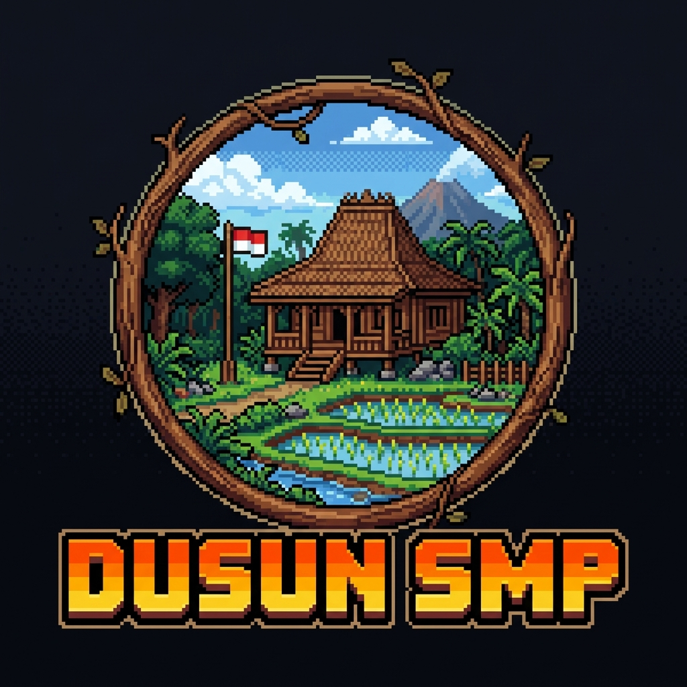
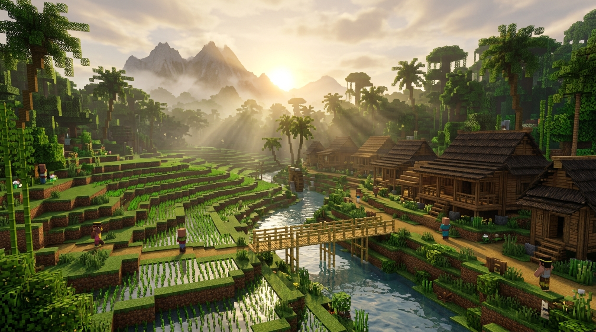

<div align="center">

# 🌲 Dusun SMP Website Resmi 🌲

[](./LICENSE)
[](#)
[](#)
[](#)



### *Survival Village Indonesia Minecraft Server*
Sebuah landing page resmi premium, ringan, dan modern yang menyajikan pesona dan petualangan di dunia Minecraft Dusun SMP.

[Kunjungi Live Demo](https://play.dusunsmp.com) • [Laporkan Masalah](./SUPPORT.md) • [Kontribusi](./CONTRIBUTING.md)

---



</div>

## 📖 Tentang Proyek

Proyek ini adalah **Landing Page Resmi Dusun SMP**, sebuah server Minecraft Survival Economy dengan sentuhan kebudayaan pedesaan nusantara Indonesia yang asri. Website ini dirancang khusus untuk memikat calon pemain baru, memberikan informasi teknis koneksi yang akurat, menyajikan tata tertib (rules) secara elegan, serta mempermudah warga untuk bergabung ke grup komunitas WhatsApp dan Discord.

Website ini dibuat dengan pendekatan **Client-Side Single Page Application (SPA)** yang ultra-responsif, memiliki performa rendering super cepat, transisi visual yang mulus, serta penataan tipografi yang nyaman dibaca di seluruh resolusi layar (dari layar handphone kecil, layar lipat, hingga monitor ultra-lebar).

---

## 🛠️ Teknologi yang Digunakan

Website ini dibangun menggunakan kombinasi teknologi modern standar industri:
* **React 19** & **TypeScript** - Untuk pembangunan komponen UI yang aman, interaktif, dan modular.
* **Vite** - Sebagai bundler super cepat yang memperlancar siklus pengembangan lokal.
* **Tailwind CSS v4** - Menggunakan framework utility-first generasi terbaru untuk pengaturan tata letak, warna, dan tema asri yang presisi.
* **Framer Motion** - Memberikan efek mikro-interaksi, transisi scroll, dan efek melayang (floating) halus pada logo.
* **Lucide React** - Set ikon bersih dan elegan untuk memperjelas setiap informasi visual.
* **API mcsrvstat.us** - Menghubungkan website dengan status server Minecraft secara real-time (tanpa rekayasa data).

---

## 🚀 Panduan Instalasi Lokal

Ingin menjalankan website ini di komputermu sendiri? Silakan ikuti langkah-langkah mudah berikut:

### Prasyarat (Prerequisites)
Pastikan kamu sudah menginstal **Node.js (versi 18+)** di komputermu.

### Langkah-langkah:
1. **Clone Repository ini:**
   ```bash
   git clone https://github.com/username/dusun-smp-website.git
   cd dusun-smp-website
   ```

2. **Instal seluruh dependensi npm:**
   ```bash
   npm install
   # atau menggunakan pnpm
   pnpm install
   ```

3. **Jalankan development server:**
   ```bash
   npm run dev
   # atau menggunakan pnpm
   pnpm dev
   ```
   Buka peramban (browser) dan akses alamat `http://localhost:3000` untuk melihat hasilnya secara langsung.

4. **Build untuk Produksi (Production Ready):**
   ```bash
   npm run build
   # atau menggunakan pnpm
   pnpm build
   ```
   Hasil kompilasi file statis yang optimal dan siap dideploy akan tersimpan di dalam folder `dist/`.

---

## ⚙️ Cara Melakukan Kustomisasi (Customization Guide)

Kami merancang website ini agar sangat mudah dikelola oleh pemilik server tanpa harus membongkar struktur kode visual HTML.

### 1. Mengubah Data Server (IP, Port, Aturan, Fitur)
Seluruh teks informasi, alamat IP, port Java/Bedrock, link WhatsApp, link Discord, daftar fitur, hingga daftar aturan bermain (rules) dikelola terpusat pada file:
👉 **`/src/config/site.ts`**

Kamu hanya perlu membuka file tersebut dan mengubah nilainya. Contoh mengubah alamat IP:
```typescript
export const siteConfig = {
  name: "Dusun SMP",
  server: {
    ip: "ganti-dengan-ip-kamu.com", // Ubah alamat IP di sini
    portJava: 25565,
    portBedrock: 19132,
    // ...
  }
}
```

### 2. Mengganti Gambar Logo Utama
Website memuat logo melayang besar di tengah dari folder public. Untuk menggantinya dengan logo komunitasmu:
1. Siapkan file gambar logo baru berbentuk persegi (rekomendasi format `.png` dengan latar belakang transparan).
2. Simpan gambar tersebut ke folder **`/public/logo.png`** (timpa file lama dengan nama yang sama persis).

### 3. Mengganti Gambar Latar Belakang (Hero Background)
Untuk mengubah pemandangan sawah di latar belakang hero:
1. Siapkan foto screenshot terbaik dari duniamu (rekomendasi landscape rasio 16:9, resolusi tinggi).
2. Simpan dan beri nama ke folder **`/public/hero-bg.webp`** (timpa file lama dengan nama yang sama persis).

---

## 📁 Struktur Folder Proyek

Berikut adalah peta struktur folder utama untuk memudahkan navigasi:

```text
├── .github/                  # Konfigurasi GitHub (CI/CD, Issue & PR templates)
│   ├── ISSUE_TEMPLATE/       # Template laporan bug dan usulan fitur
│   ├── workflows/            # Pipeline build & lint otomatis (GitHub Actions)
│   ├── dependabot.yml        # Otomatisasi pemantauan pembaruan paket npm
│   └── PULL_REQUEST_TEMPLATE # Standar pengajuan kode kontributor
├── public/                   # Aset statis yang diakses langsung oleh browser
│   ├── logo.png              # Gambar logo bulat pixel-art Dusun SMP
│   └── hero-bg.webp          # Gambar latar belakang Minecraft desa
├── src/
│   ├── components/           # Kumpulan komponen modular UI
│   │   ├── DeveloperBar.tsx  # GitHub Ribbon & informasi API developer di atas
│   │   ├── Header.tsx        # Navigasi atas yang merespon scroll (sticky & blur)
│   │   ├── Hero.tsx          # Banner utama dengan logo melayang dan CTA
│   │   ├── AboutSection.tsx  # Pengenalan dusun & tabel spesifikasi teknis
│   │   ├── FeaturesSection.tsx # Tiga keunggulan server dari config
│   │   ├── RulesSection.tsx  # Daftar aturan bernomor otomatis & berikon
│   │   ├── JoinSection.tsx   # Langkah masuk server via PC & Mobile + Salin Port
│   │   ├── CommunitySection.tsx # Ajakan bergabung ke Discord & WhatsApp
│   │   └── Footer.tsx        # Keterangan hak cipta & badge info developer
│   ├── config/
│   │   └── site.ts           # PUSAT DATA UTAMA SERVER (Sangat mudah diubah!)
│   ├── types/
│   │   └── index.ts          # Definisi tipe TypeScript (developer & status API)
│   ├── App.tsx               # Komponen utama penyusun tata letak halaman
│   ├── index.css             # Impor font Google & variabel tema warna Tailwind v4
│   └── main.tsx              # Titik masuk utama aplikasi React 19
├── index.html                # Kerangka dasar HTML5 & pengaturan favicon
├── tsconfig.json             # Aturan kompilasi TypeScript
└── vite.config.ts            # Konfigurasi bundler Vite
```

---

## ☁️ Panduan Deploy ke Vercel

Website ini 100% kompatibel dan sangat siap diunggah ke layanan hosting gratis **Vercel** hanya dalam waktu kurang dari 2 menit:

1. Hubungkan repository GitHub kamu ke akun Vercel.
2. Klik tombol **Add New Project** di dashboard Vercel, pilih repository website Dusun SMP ini.
3. Vercel akan secara otomatis mendeteksi konfigurasi **Vite**.
4. Biarkan pengaturan default (Build Command: `npm run build`, Output Directory: `dist`).
5. Klik **Deploy**. Selesai! Website kamu kini aktif dan siap dibagikan ke seluruh calon pemain.

---

## 🔄 Cara Melakukan Pembaruan Kode

Untuk memastikan website kamu selalu menggunakan versi stabil terbaru atau menerima perbaikan performa:
1. Ambil pembaruan terbaru dari repository utama:
   ```bash
   git pull origin main
   ```
2. Pastikan paket npm dalam keadaan terinstal dengan benar:
   ```bash
   npm install
   ```
3. Lakukan build ulang sebelum mengunggah kembali ke server hosting produksimu.

---

## 📜 Lisensi & Kontribusi

Proyek ini dirilis di bawah lisensi resmi **[MIT License](./LICENSE)**. Kamu dibebaskan penuh untuk menduplikasi, memodifikasi, dan mempublikasikan ulang website ini untuk server komunitas Minecraft pribadimu.

* Jika kamu ingin menyumbangkan ide perubahan atau perbaikan tampilan, silakan baca **[CONTRIBUTING.md](./CONTRIBUTING.md)**.
* Mari saling menghormati di ruang diskusi dengan menyetujui aturan ramah dalam **[CODE_OF_CONDUCT.md](./CODE_OF_CONDUCT.md)**.
* Butuh bantuan dalam troubleshooting? Silakan rujuk panduan di **[SUPPORT.md](./SUPPORT.md)**.

---

<div align="center">

### 🌾 Terima Kasih Banyak! 🌾
*Selamat bersenang-senang membangun desa impianmu di dunia Dusun SMP. Mari gotong royong menjaga alam nusantara tetap lestari, rukun bertetangga, dan salam sukses untuk seluruh warga dusun!*

</div>
